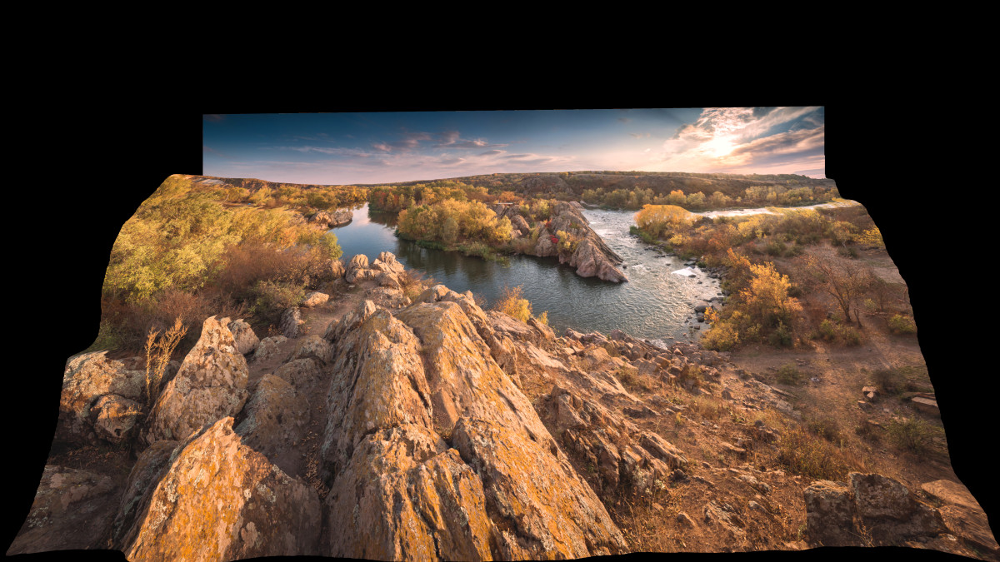
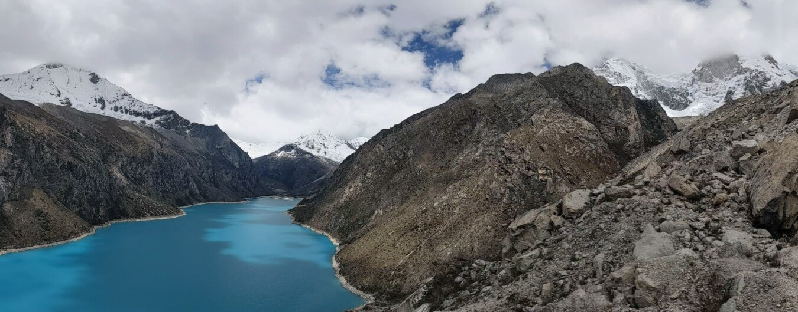
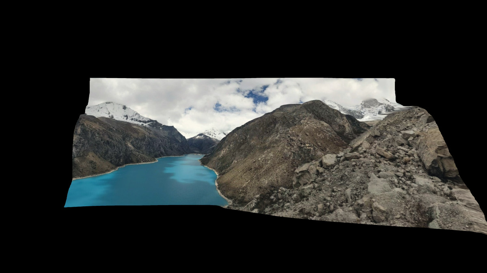

# DepthViewer
 \
Using [MiDaS Machine Learning Model](https://github.com/isl-org/MiDaS), renders 2D videos/images into 3D object with Unity for VR.

## Try Now
- [WebGL Demo](https://parkchamchi.github.io/DepthViewer/) ([WebXR version](https://parkchamchi.github.io/DepthViewer/vr_version/))
- [Releases](https://github.com/parkchamchi/DepthViewer/releases)
- [Steam Page](https://store.steampowered.com/app/2218510/DepthViewer/)
- [Play Store (Yes, you can use your $5 cardboard)](https://play.google.com/store/apps/details?id=com.parkchamchi.DepthViewer)

## Examples

| Original input (resized) | v2.1 small (built in) | Src |
| --- | --- | --- |
|  |  | [#](https://commons.wikimedia.org/wiki/File:%D0%9F%D0%B0%D0%BD%D0%BE%D1%80%D0%B0%D0%BC%D0%B0_%D0%86%D0%BD%D1%82%D0%B5%D0%B3%D1%80%D0%B0%D0%BB%D1%83.jpg) |
|  |  | [#](https://pixnio.com/media/lake-dark-blue-glacier-mountain-peak-landscape) |

| Original input (resized) | v2.1 small (built in) | dpt-large model | Src |
| --- | --- | --- | --- |
|  |  |  | [#](https://commons.wikimedia.org/wiki/File:Cat_kneading_blanket.gk.webm) |

## Models
The built-in model is [MiDaS v2.1 small model](https://github.com/isl-org/MiDaS/releases/tag/v2_1), which is ideal for real-time rendering.

### Calling python (Optional)
The [MiDaS v3 DPT models](https://github.com/isl-org/MiDaS), which is exceptionally accurate, hasn't been released as ONNX model that can be used with Unity's Barracuda.
The `Call Python` buttons will call python subprocess and process it with pytorch. 
For now it just calls `python ./depthpy/depth.py [args]...`, so dependency for MiDaS and `depth.py` should be installed manually, for that also check the [MiDaS github page](https://github.com/isl-org/MiDaS). 

1. Install Python3. The version I use is `3.9.6`. By default the program calls `python`, assuming it is on PATH. This can be changed in the options menu.
2. Install OpenCV and Numpy. <br>
`pip install opencv-python numpy`
3. (Optional but recommended) Install CUDA. You may want to get the [version 11.7](https://developer.nvidia.com/cuda-11-7-0-download-archive); see below.
4. Install Pytorch that matches your environment from [here](https://pytorch.org/get-started/locally/). For me (win64 cuda11.7) it is <br>
`pip install torch torchvision --extra-index-url https://download.pytorch.org/whl/cu117`
5. Install [timm](https://pypi.org/project/timm/) for MiDaS. <br>
`pip install timm`
6. Go to the directory `depthpy` and run <br>
`python depth.py -h` <br>
and see if it prints the manual without any error.
7. Get `dpt_hybrid` and `dpt_large` models from [here](https://github.com/isl-org/MiDaS#setup) and locate them in `depthpy/weights`. Do not change the filenames.
8. Place any image in the `depthpy` directory, rename it to `test.jpg` (or `test.png`) and run <br>
`python depth.py test.jpg out.depthviewer -i` <br>
See if it generates an output. Also check if `depth.py` is using CUDA by checking `device: cuda` line.

#### If it isn't and you want to use CUDA:
- Check the installed CUDA version and if the installed Pytorch version supports that.
- Uninstall Pytorch `pip uninstall torch torchvision` and reinstall it.

#### For depthserver.py
- Install Flask `pip install Flask`

## Inputs
- Right mouse key: hides the UI.
- WASD: rotate the mesh.

## Notes
- If VR HMD is detected, it will open with OpenXR.
- All outputs will be cached to `Application.persistentDataPath` (In Windows, `...\AppData\LocalLow\parkchamchi\DepthViewer`).
- Depth files this program creates are of extention `.depthviewer`, which is a zip file with .pgm files and a metadata file.
- Rendering the desktop is only supported in Windows for now.
- C# scripts are in [DEPTH/Assets/Scripts](DEPTH/Assets/Scripts).
- Python scripts are in [DEPTH/depthpy](DEPTH/depthpy).

## Recording 360 VR video
If you select a depthfile and an according image/video, a sequence of .jpg file will be generated in `Application.persistentDataPath`. \
Go to the directory, and execute
```xml
ffmpeg -framerate <FRAMERATE> -i %d.jpg <output.mp4>
```
Where `<FRAMERATE>` is the original FPS. 

To add audio,
```xml
ffmpeg -i <source.mp4> -i <output.mp4> -c copy -map 1:v:0 -map 0:a:0 -shortest <output_w_audio.mp4>
```

## Tested formats:
### Images
- .jpg
- .png

### Videos
- .mp4 : 
Some files can't be played because Unity can't open them. (e.g. VP9) \
Other formats have not been tested.

## Todo
- Overhaul UI & Control
- Add more options
- Fix codecs
- Stablize
### WIP
- Native DPT models support
- VR controllers support [(See here)](https://github.com/parkchamchi/UnityVRControllerTest)

## Building
The Unity Editor version used: `2021.3.10f1`

### ONNX Runtime dll files
These dll files have to be in `DEPTH/Assets/Plugins/OnnxRuntimeDlls/win-x64/native`.
They are in the nuget package files (.nupkg), get them from <br>
<br>
[Microsoft.ML.OnnxRuntime.Gpu](https://www.nuget.org/packages/Microsoft.ML.OnnxRuntime.Gpu/) => `microsoft.ml.onnxruntime.gpu.1.13.1.nupkg/runtimes/win-x64/native/*.dll` <br>
- `onnxruntime.dll`
- `onnxruntime_providers_shared.dll`
- `onnxruntime_providers_cuda.dll`
- I don't think this is needed: `onnxruntime_providers_tensorrt.dll`

[Microsoft.ML.OnnxRuntime.Managed](https://www.nuget.org/packages/Microsoft.ML.OnnxRuntime.Managed/) => `microsoft.ml.onnxruntime.managed.1.13.1.nupkg/lib/netstandard1.1/*.dll` <br>
- `Microsoft.ML.OnnxRuntime.dll`

## Misc
### Libraries used
- [Unity Standalone File Browser](https://github.com/gkngkc/UnityStandaloneFileBrowser) (MIT License)
- [Unity Simple File Browser](https://github.com/yasirkula/UnitySimpleFileBrowser) (MIT License)
- [WebXR Export](https://github.com/De-Panther/unity-webxr-export) (Apache License 2.0)
- [Google Cardboard XR Plugin for Unity](https://github.com/googlevr/cardboard-xr-plugin) (Apache License 2.0)
- [UniGif](https://github.com/WestHillApps/UniGif) (MIT License)
- [ONNX Runtime](https://github.com/microsoft/onnxruntime) (MIT License)
- [UnityIngameDebugConsole](https://github.com/yasirkula/UnityIngameDebugConsole) (MIT License)

- Font used: [Noto Sans KR](https://fonts.google.com/noto/specimen/Noto+Sans+KR) (SIL Open Font License)
- [Readme file](DEPTH/Assets/Assets/README.txt)

### Also check out
- This project was inspired by [VRin](https://www.vrin.app/)
- [monocular-depth-unity](https://github.com/GeorgeAdamon/monocular-depth-unity) ([used this code](https://github.com/GeorgeAdamon/monocular-depth-unity/blob/main/MonocularDepthBarracuda/Packages/DepthFromImage/Runtime/DepthFromImage.cs))
- [godot-midas-depth](https://github.com/lewiji/godot-midas-depth)