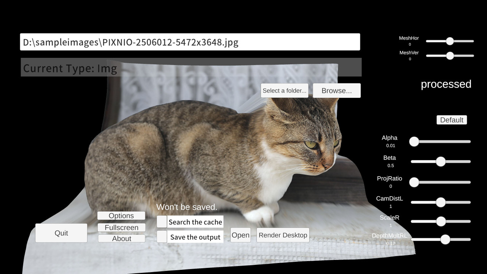
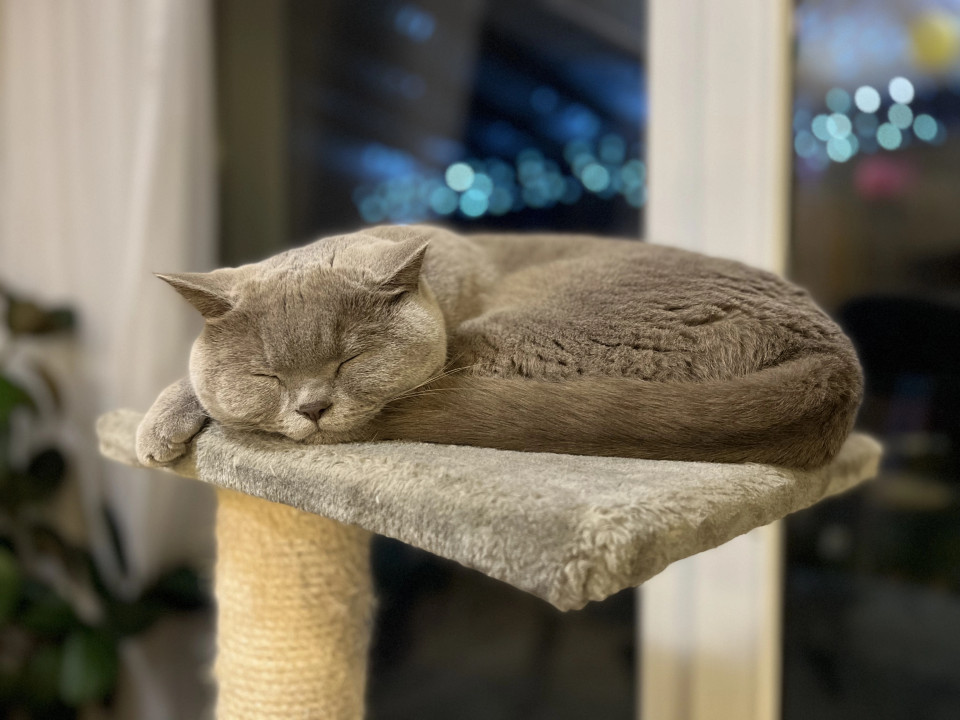
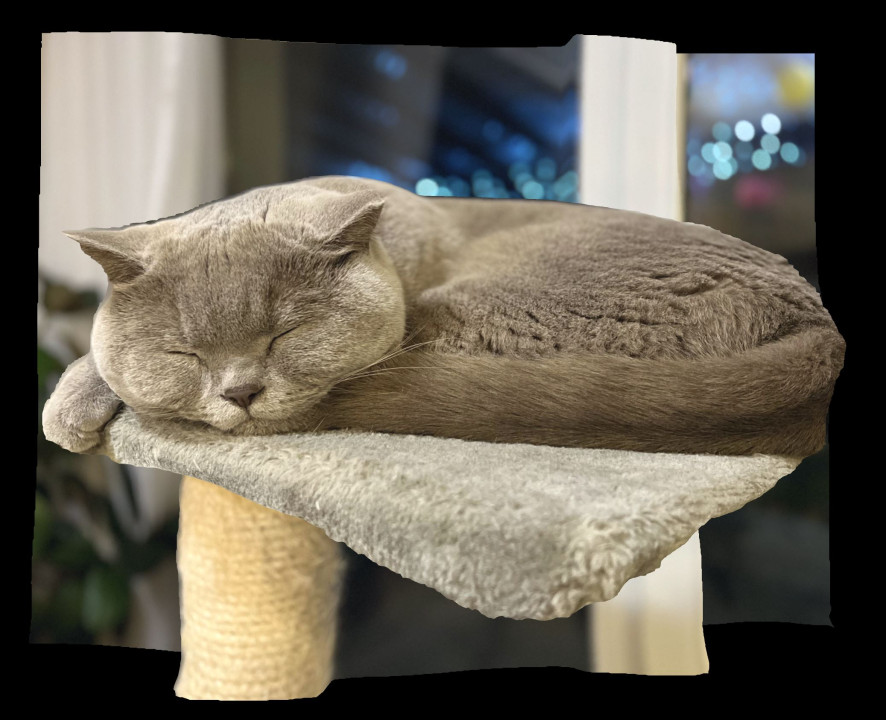
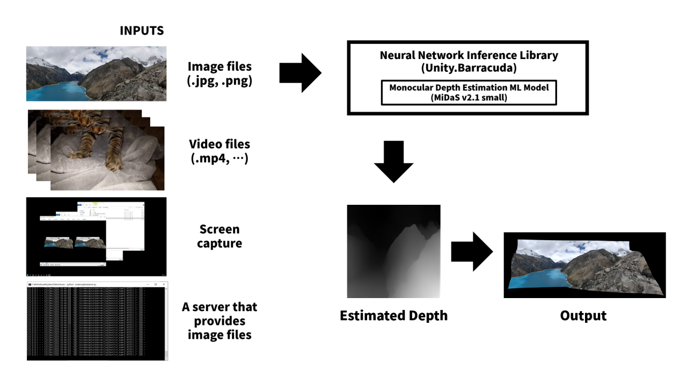
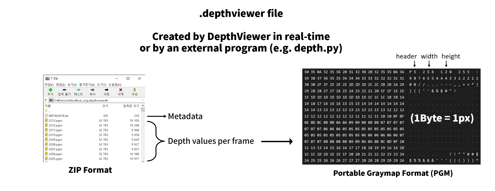

# DepthViewer
 \
Using [MiDaS Machine Learning Model](https://github.com/isl-org/MiDaS), renders 2D videos/images into 3D object with Unity for VR.

## Try Now
- [Releases](https://github.com/parkchamchi/DepthViewer/releases)
- [Steam Page](https://store.steampowered.com/app/2218510/DepthViewer/)

### Outdated builds (less effective 3D)
- [WebGL Demo](https://parkchamchi.github.io/DepthViewer/) ([WebXR version](https://parkchamchi.github.io/DepthViewer/vr_version/))
- [Play Store (For Cardboards)](https://play.google.com/store/apps/details?id=com.parkchamchi.DepthViewer)

## Examples

| Original input (resized) | Plotted (MiDaS v2.1) | Projected | Src |
| --- | --- | --- | --- |
|  |  |  | [#](https://commons.wikimedia.org/wiki/File:Cat_on_a_cat_tree.webp)

## So what is this program?
This program is essentially a depthmap plotter with an integrated depthmap inferer, with VR support.<br>
<br>
<br>
<br>

The depthmaps can be cached to a file so that it can be loaded later.
<br>
<br>
<br>

## Inputs
- Right mouse key: hides the UI.
- WASD: rotate the mesh.
- Backtick `: opens the console.
- Numpad 4/5/6: pause/skip the video.

## Models
The built-in model is [MiDaS v2.1 small model](https://github.com/isl-org/MiDaS/releases/tag/v2_1), which is ideal for real-time rendering.

### Loading ONNX models

#### Tested onnx files:
- [MiDaS v2.1 384 (`model-f6b98070.onnx`)](https://github.com/isl-org/MiDaS/releases/tag/v2_1)
- [MiDaS v3 models (unofficial)](https://github.com/parkchamchi/MiDaS/releases/tag/22.12.07)
- [MiDaS v3.1 models (unofficial)](https://github.com/parkchamchi/MiDaS/releases/tag/23.02.18)

From my experience `dpt_hybrid_384` seems to be more robust against drawn images (i.e. non-photos)

- Put the onnx files under the `onnx` directory.
- Open this options menu and select the file and click the `Load` button

CUDA for OnnxRuntime requires cuDNN, see [here](https://onnxruntime.ai/docs/execution-providers/CUDA-ExecutionProvider.html)

## Recording 360 VR video
If you select a depthfile and an according image/video, a sequence of .jpg file will be generated in `Application.persistentDataPath`. \
Go to the directory, and execute
```xml
ffmpeg -framerate <FRAMERATE> -i %d.jpg <output.mp4>
```
Where `<FRAMERATE>` is the original FPS. 

To add audio,
```xml
ffmpeg -i <source.mp4> -i <output.mp4> -c copy -map 1:v:0 -map 0:a:0 -shortest <output_w_audio.mp4>
```

## Connecting to an image server
The server has to provide a `jpg` or `png` bytestring when requested. 
Like [this program](https://github.com/parkchamchi/screencaptureserver): it captures the screen and returns the jpg file.
I found it to be faster than the built-in one (20fps for 1080p video).
<br>
Open the console with the backtick ` key and execute (url is for the project above, targeting the second monitor)
```
httpinput localhost:5000/screencaptureserver/jpg?monitor_num=2
```

## Importing/Exporting parameters for the mesh
After loading an image or a video while the `Save the output` toggle is on, enter the console command
```
e
```
This saves the current parameters (`Scale`, ...) into the depthfile so that it can be used later.

## Tested formats:
### Images
- .jpg
- .png

### Videos
- .mp4, ... : 
Some files can't be played because Unity's VideoPlayer can't open them. (e.g. VP9) 

### Others
- .gif : Certain formats are not supported.
- .pgm : Can be used as a depthmap (Needs a subsequential image input)
- .depthviewer

## Notes
- If VR HMD is detected, it will open with OpenXR.
- All outputs will be cached to `Application.persistentDataPath` (In Windows, `...\AppData\LocalLow\parkchamchi\DepthViewer`).
- Depth files this program creates are of extention `.depthviewer`, which is a zip file with .pgm files and a metadata file.
- To create `.depthviewer` files using python, see [here](./DEPTH/depthpy/README.md)
- Rendering the desktop is only supported in Windows for now.
- C# scripts are in [DEPTH/Assets/Scripts](DEPTH/Assets/Scripts).
- Python scripts are in [DEPTH/depthpy](DEPTH/depthpy).

## Todo
- Overhaul UI & Control
- Add more options
- Fix codecs
- Stablize
### WIP
- VR controllers support [(See here)](https://github.com/parkchamchi/UnityVRControllerTest)
- Support for the servers that send both the image file and the depthmap

## Building
The Unity Editor version used: `2021.3.10f1`

### ONNX Runtime dll files
These dll files have to be in `DEPTH/Assets/Plugins/OnnxRuntimeDlls/win-x64/native`.
They are in the nuget package files (.nupkg), get them from <br>
<br>
[Microsoft.ML.OnnxRuntime.Gpu](https://www.nuget.org/packages/Microsoft.ML.OnnxRuntime.Gpu/) => `microsoft.ml.onnxruntime.gpu.1.13.1.nupkg/runtimes/win-x64/native/*.dll` <br>
- `onnxruntime.dll`
- `onnxruntime_providers_shared.dll`
- `onnxruntime_providers_cuda.dll`
- I don't think this is needed: `onnxruntime_providers_tensorrt.dll`

[Microsoft.ML.OnnxRuntime.Managed](https://www.nuget.org/packages/Microsoft.ML.OnnxRuntime.Managed/) => `microsoft.ml.onnxruntime.managed.1.13.1.nupkg/lib/netstandard1.1/*.dll` <br>
- `Microsoft.ML.OnnxRuntime.dll`

## Misc

### Libraries used

- [MiDaS](https://github.com/isl-org/MiDaS) (MIT License)
```
@article {Ranftl2022,
    author  = "Ren\'{e} Ranftl and Katrin Lasinger and David Hafner and Konrad Schindler and Vladlen Koltun",
    title   = "Towards Robust Monocular Depth Estimation: Mixing Datasets for Zero-Shot Cross-Dataset Transfer",
    journal = "IEEE Transactions on Pattern Analysis and Machine Intelligence",
    year    = "2022",
    volume  = "44",
    number  = "3"
}
```

- [monocular-depth-unity](https://github.com/GeorgeAdamon/monocular-depth-unity) (MIT License)
- [Unity Standalone File Browser](https://github.com/gkngkc/UnityStandaloneFileBrowser) (MIT License)
- [Unity Simple File Browser](https://github.com/yasirkula/UnitySimpleFileBrowser) (MIT License)
- [WebXR Export](https://github.com/De-Panther/unity-webxr-export) (Apache License 2.0)
- [Google Cardboard XR Plugin for Unity](https://github.com/googlevr/cardboard-xr-plugin) (Apache License 2.0)
- [UniGif](https://github.com/WestHillApps/UniGif) (MIT License)
- [ONNX Runtime](https://github.com/microsoft/onnxruntime) (MIT License)
- [In-game Debug Console for Unity 3D](https://github.com/yasirkula/UnityIngameDebugConsole) (MIT License)
- [Pcx - Point Cloud Importer/Renderer for Unity](https://github.com/keijiro/Pcx) (The Unlicense)

- Font used: [Noto Sans KR](https://fonts.google.com/noto/specimen/Noto+Sans+KR) (SIL Open Font License)
- [Readme file](DEPTH/Assets/Assets/README.txt)

### Also check out
- This project was inspired by [VRin](https://www.vrin.app/)
- [godot-midas-depth](https://github.com/lewiji/godot-midas-depth)

## Remarks

This project was started in September 2022 with primary goal of using monocualar depth estimation ML model for VR headsets.
I could not find any existing programs that fit this need, except for a closed-source program *VRin* (link above).
That program (then and still in `Alpha 0.2`) was the main inspiration for this project, but I needed more features like image inputs, other models, etc.
As it was closed source, I grabbed a [Unity/C# book](https://www.amazon.com/Learning-Developing-Games-Unity-2021/dp/1801813949) and started to generate a mesh from script.

I gradually added features by trial-and-error rather than through planned development, which made the code a bit messy, and many parts of this program could have been better.
But after a series of progressions, I found the [v0.8.7](https://github.com/parkchamchi/DepthViewer/releases/tag/v0.8.7-beta) build to be *okay enough* for my personal use.
So this project is on "indefinite hiatus" from now on, but I'm still open for minor feature requests and bug fixes.

I thank all people who gave me complements, advices, bug reports, and criticisms.

Thank you.

2023 March 9

Chanjin Park
parkchamchi@gmail.com