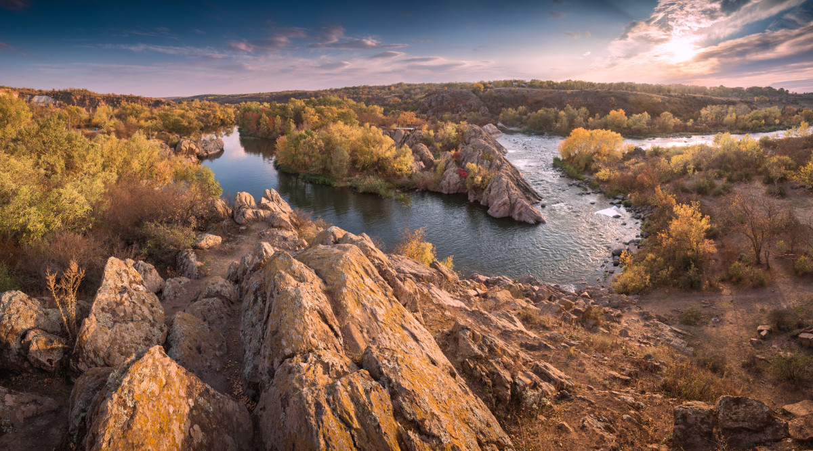
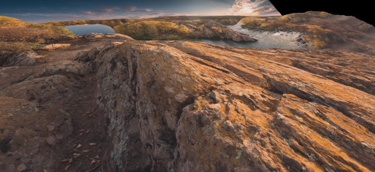
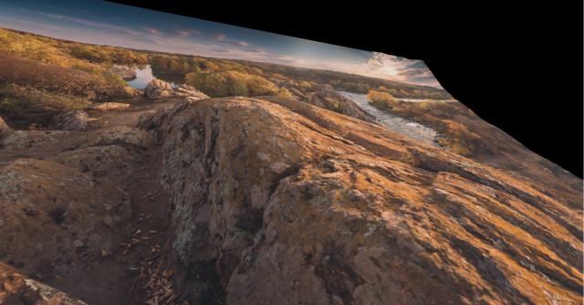
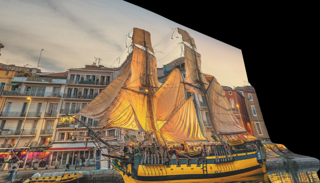
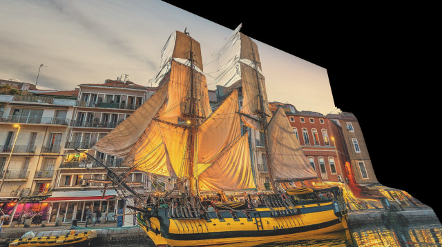
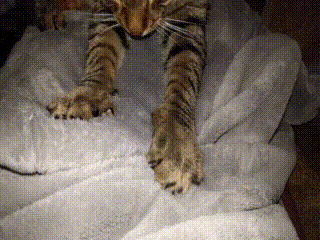

# DepthViewer
 \
Using [MiDaS Deep Learning Model](https://github.com/isl-org/MiDaS), renders 2D videos/images into 3D object with Unity for VR.

## WEB DEMO
[WebGL Demo](https://parkchamchi.github.io/DepthViewer/)

## Examples

### NOTE
Examples below are outdated and inaccurate. Please check my [Youtube channel](https://www.youtube.com/channel/UC5Y-dNipzBQOgA-r5PeAOjw) where I upload examples as 360 VR videos.

| Original input (resized) | v2.1 small (built in) | dpt-large model | Src |
| --- | --- | --- | --- |
|  |  |  | [#](https://commons.wikimedia.org/wiki/File:%D0%9F%D0%B0%D0%BD%D0%BE%D1%80%D0%B0%D0%BC%D0%B0_%D0%86%D0%BD%D1%82%D0%B5%D0%B3%D1%80%D0%B0%D0%BB%D1%83.jpg) |
|  |  |  | [#](https://commons.wikimedia.org/wiki/File:Escale_%C3%A0_S%C3%A8te_2022_D.jpg) |
|  |  |  | [#](https://commons.wikimedia.org/wiki/File:Cat_kneading_blanket.gk.webm) |
Note: Angles are not identical.

## Models
The built-in model is [MiDaS v2.1 small model](https://github.com/isl-org/MiDaS/releases/tag/v2_1), which is ideal for real-time rendering.

### Calling python (optional)
The [MiDaS v3 DPT models](https://github.com/isl-org/MiDaS), which is exceptionally accurate, hasn't been released as ONNX model that can be used with Unity's Barracuda.
The `Call Python` buttons will call python subprocess and process it with pytorch. 
For now it just calls `python ./depthpy/depth.py [args]...`, so dependency for MiDaS should be installed manually, for that check [MiDaS github page](https://github.com/isl-org/MiDaS). 
For this [dpt_hybrid and dpt_large .pt model files](https://github.com/isl-org/MiDaS#setup) has to be in `depthpy/weights` directory.

## Inputs
- Right mouse key: hides the UI.
- WASD: rotate the mesh.

## Notes
- If VR HMD is detected, it will open with OpenXR.
- All outputs will be cached to `Application.persistentDataPath` (In Windows, `...\AppData\LocalLow\parkchamchi\DepthViewer`).
- Depth files this program creates are of extention `.depthviewer`, which is a zip file with .pgm files and a metadata file.
- C# scripts are in [DEPTH/Assets/Scripts](DEPTH/Assets/Scripts).
- Python scripts are in [DEPTH/depthpy](DEPTH/depthpy).

## Recording 360 VR video
If you select a depthfile and an according image/video, a sequence of .jpg file will be generated in `Application.persistentDataPath`. \
Go to the directory, and execute
```xml
ffmpeg -framerate <FRAMERATE> -i %d.jpg <output.mp4>
```
Where `<FRAMERATE>` is the original FPS. 

To add audio,
```xml
ffmpeg -i <source.mp4> -i <output.mp4> -c copy -map 1:v:0 -map 0:a:0 -shortest <output_w_audio.mp4>
```

## Tested formats:
### Images
- .jpg
- .png

### Videos
- .mp4 : 
Some files can't be played because Unity can't open them. (e.g. VP9) \
Other formats have not been tested.

## Todo
- Overhaul UI & Control
- Add more options
- Fix codecs
- Stablize

### WIP
- Android version

## Misc
- Used [Unity Standalone File Browser](https://github.com/gkngkc/UnityStandaloneFileBrowser) (MIT License)
- Used [Unity Simple File Browser](https://github.com/yasirkula/UnitySimpleFileBrowser) (MIT License)
- Used [WebXR Export](https://github.com/De-Panther/unity-webxr-export) (Apache License 2.0)
- Font used: [Noto Sans KR](https://fonts.google.com/noto/specimen/Noto+Sans+KR) (SIL Open Font License)
- [Readme file](DEPTH/Assets/Assets/README.txt)